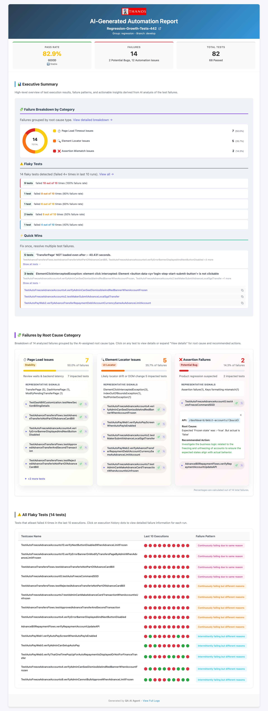

<div>
  

  # QA AI Agent

  **🤖 Automated Test Report Analyzer | Database-First Intelligence | Two-Level Failure Classification | Flaky Test Detection**

  [](https://www.python.org/)
  [](LICENSE)
</div>

---

## 📋 Table of Contents
- [Overview](#-overview)
- [Sample Report](#-sample-report)
- [Features](#-features)
- [Quick Start](#-quick-start)
- [Architecture & Components](#-architecture--components)
- [Project Structure](#-project-structure)
- [Troubleshooting](#-troubleshooting)
- [Creator](#-creator)

---

## 🎯 Overview
**QA AI Agent** is an intelligent, automated analysis system that transforms raw test execution data into actionable insights. Unlike traditional report generators, it uses a **database-first approach** combined with **HTML log parsing** to provide a complete picture of test health.

It leverages **Generative AI (OpenAI or Ollama)** to classify failures with human-like understanding, distinguishing between genuine product bugs and automation issues.

### What It Does
- **🤖 Intelligent Classification**: Automatically analyzes failure logs to determine if a failure is a `🐛 Product Bug` or `🔧 Automation Issue`.
- **📊 Historical Trending**: Tracks test stability over time using a MySQL database to identify flaky tests and recurring patterns.
- **📝 Root Cause Analysis**: Extracts precise root causes (e.g., "API 500 Error", "Element Not Found", "Assertion Mismatch") from verbose logs.
- **🧠 Context-Aware Recommendations**: Provides specific, actionable steps to resolve failures based on the error context.
- **📈 Interactive Reporting**: Generates a modern, single-file HTML report with executive summaries, trend charts, and detailed drill-downs.

---

## 📸 Sample Report



---

## ✨ Features

### Core Capabilities
- **📊 Database-First Data Retrieval**
  - Queries MySQL database for reliable historical test results.
  - Merges database records with detailed execution logs parsed from HTML artifacts.
  
- **🤖 Two-Level AI Classification System**
  - **Level 1 (High-Level)**: Classifies as `Product Bug` vs. `Automation Issue`.
  - **Level 2 (Root Cause)**: Categorizes into `ELEMENT_NOT_FOUND`, `TIMEOUT`, `ASSERTION_FAILURE`, `ENVIRONMENT_ISSUE`, or `OTHER`.
  - powered by **GPT-4** (Cloud) or **Llama 3** (Local/Private).

- **📉 Smart Flaky Test Detection**
  - Identifies tests that flip-flop between Pass/Fail.
  - Configurable thresholds (e.g., "Failed 4 times in the last 10 runs").
  - Visualizes execution history with colored status dots.

### Report Features
- **Executive Summary**: High-level health metrics and AI-generated insights.
- **Failures by Category**: Grouped failures for efficient triage (e.g., see all "Timeouts" together).
- **Interactive UI**: Search, sort, expand details, and copy-to-clipboard functionality.

---

## 🚀 Quick Start

### Prerequisites
- **Python 3.9+** (3.11+ recommended)
- **MySQL Database** (for storage of test results)
- **LLM Provider**:
  - **Ollama** (Local, Private, Free) - *Recommended*
  - **OpenAI API Key** (Cloud, Powerful)

### Installation

```bash
# Clone the repository
git clone <repository-url>
cd QA-AI-Agent

# Create virtual environment
python3 -m venv venv
source venv/bin/activate  # Windows: venv\Scripts\activate

# Install dependencies
pip install -r requirements.txt
```

### Configuration
1. **Create environment file**:
   ```bash
   cp config/.env.example config/.env
   ```

2. **Edit `config/.env`**:
   - Set `LLM_PROVIDER=ollama` (default) or `openai`.
   - Configure `DB_HOST`, `DB_USER`, `DB_PASSWORD`, `DB_NAME`.
   - Set `INPUT_DIR` (where your raw reports live) and `OUTPUT_DIR`.

### Run the Application

**macOS / Linux:**
```bash
./scripts/run.sh --input-dir testdata/Regression-Suite --output-dir reports
```

**Windows (PowerShell):**
```powershell
.\scripts\run.ps1 --input-dir testdata/Regression-Suite --output-dir reports
```

> **Note**: If no arguments are passed, it defaults to the paths in your `.env` file.

---

## 🏗 Architecture & Components

The agent is designed with modularity in mind, separating data parsing, intelligence, and reporting.

### 🔄 Workflow
1.  **Ingest**: Locates the report directory and extracts the `buildTag`.
2.  **Query**: Fetches test results from MySQL (Status, Test Name, History).
3.  **Parse**: Reads HTML artifacts to extract full execution logs and stack traces.
4.  **Merge**: Combines DB metadata with HTML logs into unified `TestResult` objects.
5.  **Analyze**:
    *   **AI Analysis**: Sends failures to LLM for classification.
    *   **Rule Engine**: Refines categories using priority rules.
    *   **Trend Analysis**: Detects flaky tests from history.
6.  **Report**: Generates the final HTML dashboard.

### Component Diagram
```
┌────────────────────┐
│  Report Directory  │
└────────┬───────────┘
         │
         ▼
┌────────────────────┐       ┌─────────────────┐
│  Running Database  │<——————│   AgentMemory   │
│       (MySQL)      │       └────────┬────────┘
└────────────────────┘                │
                                      ▼
┌────────────────────┐       ┌─────────────────┐
│   HTML Parsers     │——————>│   DataBuilder   │
└────────────────────┘       └────────┬────────┘
                                      ▼
┌────────────────────┐       ┌─────────────────┐
│    TestAnalyzer    │<——————│   Orchestrator  │
│       (LLM)        │       └────────┬────────┘
└────────────────────┘                │
                                      ▼
                             ┌─────────────────┐
                             │ ReportGenerator │
                             └────────┬────────┘
                                      ▼
                             ┌─────────────────┐
                             │   HTML Report   │
                             └─────────────────┘
```

---

## 📁 Project Structure

```
QA-AI-Agent/
├── config/               # Configuration (.env, prompts.yaml)
├── scripts/              # Run scripts (run.sh, run.ps1)
├── src/
│   ├── agent/            # AI Logic (analyzer.py, memory.py)
│   ├── parsers/          # HTML & Data parsing
│   ├── reporters/        # HTML Generation & CSS/JS
│   ├── main.py           # Entry point
│   └── settings.py       # Config loader
├── testdata/             # Sample reports
├── reports/              # Generated outputs
└── tests/                # Unit tests
```

---

## 🐛 Troubleshooting

### Common Issues

**Q: No test results found in database?**
A: Ensure your test runner inserts results into MySQL *before* running this agent. The agent queries by `buildTag` (directory name).

**Q: AI analysis is failing or slow?**
A: If using **Ollama**, ensure the model is pulled (`ollama pull llama3.2`). If using **OpenAI**, check your API key quota.

**Q: "Table not found" error?**
A: The agent attempts to derive the table name from the report name. You can override this with `--table-name`.

---

## 📝 License
This project is open source. See [LICENSE](LICENSE) file for details.

---

## 👤 Creator
**Mukesh Rajput**

For any further help or queries, contact [@mukesh.rajput](https://www.linkedin.com/in/mukesh-rajput/)

---
<div align="center">
  <strong>Made with ❤️ for Engineering Team!</strong>
</div>